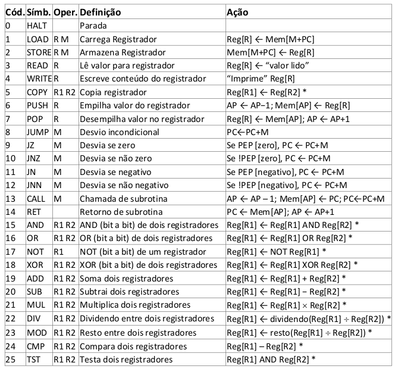
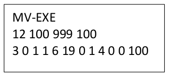
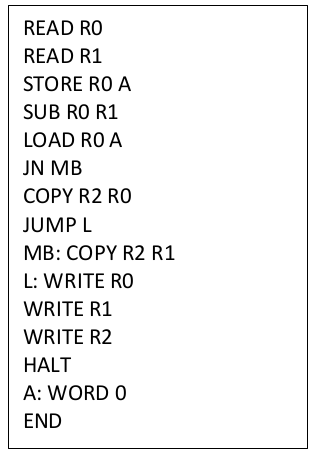

# Máquina Virtual Básica

## 📄 Descrição

Emulador de uma máquina virtual básica e seu respectivo montador, possibilitando que usuários escrevam programas a serem executados pela máquina virtual.

Trabalho prático implementado na disciplina Software Básico cursada na UFMG no semestre 2019/1.

## 🚀 Tecnologias

Implementado com a linguagem C

## Emulador da Máquina Virtual

### Registradores

A máquina virtual emulada contém **3 registradores de propósito específico**:

- **PC (contador de programas)**: contém o endereço da próxima instrução a ser executada
- **AP (apontador da pilha)**: aponta para o elemento no topo da pilha
- **PEP (palavra de estado do processador)**: consiste em 2 bits que armazenam o estado da última operação lógico/aritmética realizada na máquina, sendo um dos bits para indicar que a última operação resultou em zero, e outro bit para indicar que a última operação resultou em um valor negativo

A máquina ainda tem **4 registradores de propósito geral** indexados por um valor que varia de 0 a 3

### Memória e Endereçamento

A máquina possui uma memória de 1000 posições capaz de armazenar apenas números inteiros.

A única forma de endereçamento existente na máquina é direto, relativo ao registrador **PC**.

### Instruções

A máquina virtual é capaz de executar as 25 instruções especificadas abaixo:



**Observações**:

- As instruções **READ** e **WRITE** lêem e escrevem um inteiro na saída padrão do emulador
- As instruções são codificadas em um inteiro, podendo ter dois, um ou nenhum operando, que é o caso das instruções **RET** e **HALT**.
- Os operandos podem ser uma **posição de memória** (M, codificado como inteiro) ou um **registrador de propósito geral** (R, codificado como um inteiro entre 0 e 3).

### Formato do Arquivo de Entrada

O emulador da máquina virtual roda em linha de comando e recebe como entrada um arquivo executável para a máquina virtual.

O arquivo de entrada é definido em modo texto e deve conter as 3 linhas seguintes:

- **1ª linha: Cabeçalho de Identificação**:

  A primeira linha do arquivo deve conter o seguinte cabeçalho de identificação:

  **“MV-EXE&crarr;”** (fim de linha)

  Se o cabeçalho não for encontrado no arquivo, o loader acusa um erro de formato não-executável.

- **2ª linha: Informações Adicionais**:

  A segunda linha deve conter 4 inteiros, separados por espaços:

  - **Tamanho do programa**: número de posições de memória ocupadas pelo programa
  - **Endereço de carregamento**: posição de memória na qual o programa deverá ser inicialmente carregado.
  - **Valor inicial da pilha**: inicialização do registrador AP;
  - **Entry Point do programa**: posição de memória onde a execução do programa deve começar – inicialização do registrador PC

- **3ª linha a diante: Instruções do programa**
  Instrucões do programa em linguagem de máquina simbólica (definida em inteiros codificados em decimal).
  As instruções do programa devem ser separadas por espaço.

**Exemplo de arquivo de entrada do emulador**:



Esse arquivo contém um programa que lê um valor da entrada, e imprime o valor recebido +
100 na saída:

**Interpretação**:

2ª linha:

- O tamanho do programa é 12 (número de instruções + número de operandos + número de valores armazenados na memória)
- O endereço de carregamento do programa na memória será a posição 100
- Registrador AP é inicializado com o valor 999
- A execução do programa começará na posição 100 da memória

3ª linha:

- Operação READ (código 3) para o registrador 0
- Operação LOAD (código 1) da posição de memória 6 para o registrador 1
- Operação ADD (código 19) dos registradores 0 e 1
- Operação WRITE (código 4) do valor no registrador 0
- HALT (código 0)
- Definição do valor 100 na memória

### Montador

O montador é de dois passos e recebe como entrada um programa em linguagem simbólica com uma instrução por linha no seguinte formato:

```
[<label>:] <operador> <operando1> <operando2> [; comentário]
```

`<label>` é o símbolo textual da instrução e deve ser seguido de seus respectivos operandos.

Os operandos podem ser tanto **registradores de propósito geral** (R0, R1, R2, R3, identificados respectivamente por 0, 1, 2 e 3) como **posições de memória do programa**, identificadas por labels.

Ainda é possível definir comentários com o caracter **;**

#### Pseudo-instruções do montador

Além das instruções definidas para o emulador, o montador oferece as duas pseudo-instruções seguintes:

- **WORD \<valor\>**: Reserva a posição de memória e a inicializa com o inteiro \<valor\>
- **END**: Indica o final do programa ao montador

A posição de memória dos desvios e instruções LOAD/STORE é relativa ao PC

**Exemplo de arquivo de entrada do montador**:



## Execução

Para executar é preciso ter instalado o **make** e o compilador **gcc**.

```bash
# compila código fonte
make
```

### Execução do Montador

```bash
./assembler <caminho_arquivo_entrada> > <caminho_arquivo_saida>
```

O arquivo de entrada passado deve estar em linguagem de montagem simbólica no [formato especificado](#montador).

### Execução do Emulador

O emulador pode ser executado com o seguinte comando:

```bash
./emulator [-v] <caminho_arquivo_entrada>
```

A flag `-v` pode ser passada para ativar o modo verbose. Nesse modo o emulador imprime a cada instrução, a operação que está sendo executada, acrescido de um dump dos 7 registradores

O arquivo passado deve estar em linguagem de máquina simbólica no [formato especificado](#formato-do-arquivo-de-entrada)

## Testes

Estão disponíveis no diretório `testes` 4 programas básicos na linguagem de montagem especificada para testar o montador e as instruções do emulador.

1. Fibonacci: Lê um número inteiro n da entrada padrão e imprime o n-ésimo número da sequência de fibonacci.
1. Inverte: Lê 5 números inteiros da entrada padrão e os imprime em ordem contrária
1. Mediana: Lê 5 números inteiros da entrada padrão e imprime a mediana deles.
1. Operações: Lê dois números A e B da entrada padrão e imprime os resultados das seguintes operações:

- A AND B
- A OR B
- NOT A
- A XOR B
- A + B
- A - B
- A x B
- A : B
- A mod B

Execução:

```bash
# gera o arquivo executável
./assembler testes/fibonacci > testes/fibonacci_exec

# executa programa
./emulator testes/fibonacci_exec

```
